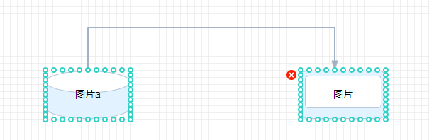

<!--
 * @Description:
 * @Version: 2.0
 * @Author: yangsen
 * @Date: 2022-04-19 15:31:29
 * @LastEditors: yangsen
 * @LastEditTime: 2022-04-19 15:37:52
-->

# 预览功能

实现思路是点击预览判断是否已经保存，如没有保存弹窗提示用户

## 判断保存

实现思路：

    一进入编辑页面就获取一次graph.toJson();
    之后每点击一次保存再次获取graph.toJson();
    当用户点击预览时再获取graph.toJson(),对比两个JSON对象是否相等；
    underScore.js库有_.isEqual()方法来判断两个对象是否相等；
    当不相等时进行弹窗提示，相等时直接跳转预览页面

为什么节点上有这么多锚点？

> 当时有一个节点上延伸出多个连接点需求，所以就用了 10 个点来简单快速的解决了；不过我看了 draw.io 是支持编辑链接点位置和数量的，后续可以优化

